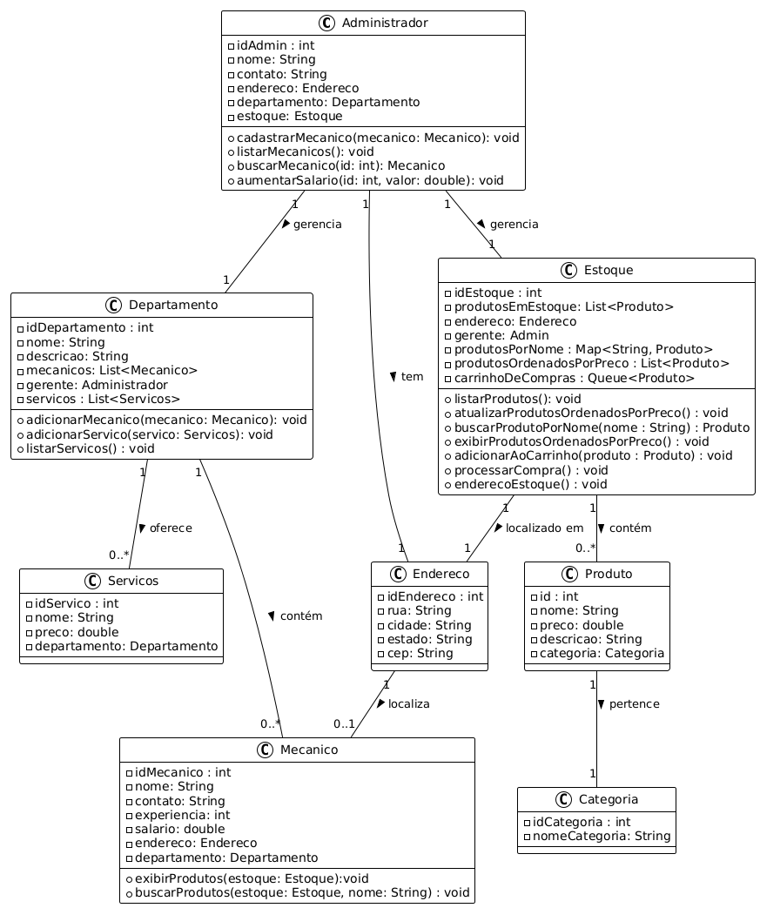

# Sprint 1 - Mobile App

**Aplicativo Mobile para Mecânicos**  

**Desenvolvido por:**  

Lucas Garcia - RM554070  

Felipe Santana - RM554259  

Enzo Barbeli - RM554272

**Instituição:** FIAP  
**Data:** Outubro de 2024  

## Sumário
1. Justificativa e Objetivos  
2. Estrutura do Aplicativo  
    - Resumo das Classes  
    - Classe `Produto`  
    - Classe `ProdutoJson`
    - Classe `Mecanico`  
    - Classe `Administrador`  
    - Classe `Estoque`  
    - Classe `Categoria`  
    - Classe `Endereco`  
    - Classe `Departamento`  
    - Classe `Servicos`  
    - Classe `ProdutoService`  
    - Classe `ApiService`  
    - Classe `RetrofitClient`  
3. Diagrama UML de Classes  
4. Descrição dos Relacionamentos  

---

## Justificativa

Nosso aplicativo foi desenvolvido com o intuito de otimizar a rotina de profissionais da área, facilitando o acesso a informações de produtos e auxiliando na localização rápida de itens necessários para reparos e manutenções. Dada a crescente demanda por soluções móveis no setor automotivo, o projeto visa reduzir o tempo gasto na busca de produtos específicos e proporcionar uma experiência digital eficiente para o usuário.

---

## Objetivos

- Facilitar o acesso às informações de produtos em uma interface amigável e intuitiva.
- Permitir a consulta e o filtro de produtos de maneira rápida e eficaz.
- Implementar uma estrutura que suporte a visualização estoque em tempo real por meio de chamadas à API.
- Prover uma estrutura escalável para futuras integrações e funcionalidades adicionais, como a expansão do catálogo de produtos e o gerenciamento de mecânicos cadastrados.

---

## Estrutura do Aplicativo

### Resumo das Classes

### 1. Classe Produto

**Responsabilidade**: Representa um produto disponível no estoque da loja de autopeças, com informações detalhadas como nome, preço, descrição e categoria.

**Atributos**:
- `id`: Identificador único do produto.
- `nome`: Nome do produto.
- `preco`: Preço do produto.
- `descricao`: Descrição detalhada do produto.
- `categoria`: Categoria à qual o produto pertence (instância da classe `Categoria`).

**Construtor**:
- **`Produto(int id, String nome, double preco, String descricao, String categoria)`**: Inicializa um novo produto com os atributos `id`, `nome`, `preco`, `descricao` e `categoria`. O campo `categoria` é instanciado com base em uma `String` passada como parâmetro, criando um novo objeto da classe `Categoria`.

**Observações**:
- O atributo `categoria` é inicializado através de um novo objeto `Categoria` que recebe uma `String` com o nome da categoria, permitindo maior flexibilidade e encapsulamento.

---
### 2. Classe ProdutoJson

**Responsabilidade**: Representa o formato de dados de um produto recebido via JSON, geralmente a partir de uma API, para facilitar a conversão e integração com a classe `Produto`.

**Atributos**:
- `id`: Identificador único do produto.
- `title`: Nome do produto.
- `price`: Preço do produto.
- `description`: Descrição detalhada do produto.
- `category`: Categoria do produto.

**Construtor**:
- **`ProdutoJson(int id, String title, double price, String description, String category)`**: Inicializa um novo objeto `ProdutoJson` com os atributos `id`, `title`, `price`, `description` e `category`, correspondentes aos dados recebidos via JSON.

Essa classe é útil para a conversão de dados JSON em objetos da aplicação. Em uma etapa posterior, os dados podem ser transformados em instâncias da classe `Produto` para manipulação interna.

---

### 3. Classe Mecanico

**Responsabilidade**: Representa um mecânico que trabalha na rede de autopeças, com funcionalidades para buscar produtos no estoque e exibir suas próprias informações.

**Atributos**:
- `idMecanico`: Identificador único do mecânico.
- `nome`: Nome do mecânico.
- `contato`: Informações de contato do mecânico.
- `experiencia`: Anos de experiência do mecânico.
- `salario`: Salário do mecânico.
- `endereco`: Endereço de atuação do mecânico (instância da classe `Endereco`).
- `departamento`: Departamento onde o mecânico trabalha (instância da classe `Departamento`).

**Construtor**:
- **`Mecanico(String nome, String contato, int experiencia, Endereco endereco)`**: Inicializa um novo mecânico com nome, contato, anos de experiência e endereço, atribuindo automaticamente um `idMecanico` único.
  
**Métodos**:
- **`buscarProdutos(Estoque estoque)`**: Exibe todos os produtos disponíveis no estoque.

- **`buscarProdutos(Estoque estoque, String criterio)`**: Busca produtos no estoque com base em um critério (nome ou categoria). Exibe as informações do produto se encontrado ou uma mensagem informando que o produto não foi localizado.

Essa classe permite ao mecânico buscar produtos no estoque por nome ou categoria e exibir informações pessoais e de trabalho. A implementação do método `buscarProdutos` usa uma lógica de busca eficiente, garantindo que as informações relevantes sejam exibidas adequadamente para o usuário final.

---

### 4. Classe Administrador

**Responsabilidade**: Representa um administrador responsável por gerenciar os mecânicos, suas informações e o estoque da loja de autopeças.

**Atributos**:
- `idAdministrador`: Identificador único do administrador.
- `nome`: Nome do administrador.
- `contato`: Informações de contato do administrador.
- `endereco`: Endereço do administrador (instância da classe `Endereco`).
- `departamento`: Departamento onde os mecânicos estão alocados (instância da classe `Departamento`).
- `estoque`: Estoque de produtos da loja (instância da classe `Estoque`).

**Construtor**:
- **`Admin(String nome, String contato, Endereco endereco)`**: Inicializa um novo administrador com nome, contato e endereço.

**Métodos**:
- **`cadastrarMecanico(Mecanico mecanico)`**: Registra um mecânico no departamento associado ao administrador. Se o departamento não estiver atribuído, exibe uma mensagem de erro.
  
- **`buscarMecanico(int id)`**: Realiza a busca de um mecânico pelo seu `id` dentro do departamento. Retorna o mecânico encontrado ou exibe uma mensagem de erro caso não o encontre.

- **`listarMecanicos()`**: Exibe uma lista de todos os mecânicos alocados no departamento associado ao administrador.

- **`aumentarSalario(int id, double valor)`**: Aumenta o salário de um mecânico identificado por `id`, se ele tiver mais de 1 ano de experiência. Caso contrário, exibe uma mensagem informando que não foi possível realizar o aumento.

Essa classe permite ao administrador interagir com os mecânicos e seu departamento, realizando ações como o cadastro de mecânicos, listagem e aumento de salário, garantindo uma boa gestão interna.

---

### 5. Classe Estoque

**Responsabilidade**: Representa o estoque de produtos em uma loja de autopeças. Gerencia a lista de produtos, o endereço do estoque, e a interação com o administrador (gerente). Também realiza a busca e listagem dos produtos utilizando um serviço externo, além de implementar funcionalidades de busca, cotação de preços, e processo de compra utilizando diferentes estruturas de dados.

**Atributos**:
- `idEstoque` : Identificador único do estoque.
- `endereco`: Endereço onde o estoque está localizado (instância da classe `Endereco`).
- `produtosEmEstoque`: Lista de produtos presentes no estoque (lista de instâncias de `Produto`).
- `gerente`: Administrador responsável pelo estoque (instância da classe `Admin`).
- `produtoService`: Serviço responsável por buscar produtos de uma fonte externa (instância da classe `ProdutoService`).
- `produtosPorNome`: Mapa para busca de produtos por nome. Usa o nome do produto como chave e o próprio produto como valor (`Map<String, Produto>`).
- `produtosOrdenadosPorPreco`: Lista de produtos ordenados por preço, usada para exibição dos produtos mais baratos ou caros (`List<Produto>`).
- `carrinhoDeCompras`: Fila de produtos adicionados ao carrinho para o processo de compra (`Queue<Produto>`).

**Construtor**:
- **`Estoque(Endereco endereco, Admin gerente)`**: Inicializa o estoque com um endereço e um gerente. O estoque é associado ao gerente, e o serviço de produtos é instanciado.

**Métodos**:
- **`listarProdutos()`**: Faz uma chamada ao `ProdutoService` para buscar os produtos de uma fonte externa (via API, por exemplo) e adicioná-los à lista `produtosEmEstoque`. Após obter a lista de produtos, exibe o endereço do estoque e as informações de cada produto.
  
- **`enderecoEstoque()`**: Exibe o endereço completo do estoque, utilizando o método `getEnderecoCompleto()` da classe `Endereco`.

- **`atualizarProdutosOrdenadosPorPreco()`**: Atualiza a lista de produtos ordenados por preço, criando uma nova lista com os produtos em estoque e ordenando-os pelo preço (`O(n log n)` de complexidade). A lista `produtosOrdenadosPorPreco` é ordenada de acordo com o preço dos produtos utilizando `Comparator.comparing(Produto::getPreco)`.

- **`buscarProdutoPorNome(String nome)`**: Retorna o produto associado ao nome fornecido, utilizando o mapa `produtosPorNome`. A busca no mapa é realizada em **O(1)**, já que a chave (nome) permite acesso direto ao valor (produto).

- **`exibirProdutosOrdenadosPorPreco()`**: Exibe todos os produtos ordenados por preço. A exibição segue a ordem crescente de preços, utilizando a lista `produtosOrdenadosPorPreco`.

- **`adicionarAoCarrinho(Produto produto)`**: Adiciona o produto ao carrinho de compras (representado por uma fila `carrinhoDeCompras`). A adição à fila é realizada em **O(1)**, pois as operações de inserção e remoção em uma fila são eficientes.

- **`processarCompra()`**: Processa a compra, removendo os produtos do carrinho e do estoque. Para cada produto no carrinho, é verificado se ele está presente no estoque. Se o produto for encontrado, ele é removido do estoque e comprado. Esse processo envolve a remoção de produtos da lista `produtosEmEstoque` e é realizado em **O(n)** no pior caso, onde `n` é o número de produtos no estoque, já que o método `contains()` da lista percorre os elementos da lista.

---

**Justificativa das Estruturas de Dados**:
- **`Map<String, Produto>` (produtosPorNome)**: Um mapa foi escolhido para a busca de produtos por nome, pois a pesquisa no mapa é muito eficiente com complexidade de **O(1)** no pior caso, já que ele permite acesso direto ao produto usando o nome como chave.
- **`List<Produto>` (produtosOrdenadosPorPreco)**: Uma lista foi escolhida para armazenar os produtos ordenados por preço. Embora a ordenação tenha uma complexidade de **O(n log n)**, ela permite uma exibição fácil e rápida dos produtos ordenados. A ordenação da lista é feita sempre que o estoque é atualizado.
- **`Queue<Produto>` (carrinhoDeCompras)**: Uma fila foi escolhida para o carrinho de compras, já que o processo de compra segue a ordem em que os produtos são adicionados. As operações de adição (`add()`) e remoção (`poll()`) em uma fila são realizadas em **O(1)**, tornando a estrutura eficiente para esse tipo de processo.

Essa implementação permite que o estoque de produtos seja gerenciado de forma eficiente, com métodos otimizados para busca, ordenação, e processamento de compras, utilizando as melhores estruturas de dados para cada funcionalidade.

---

### 6. Classe Categoria

**Responsabilidade**: Representa a categoria de um produto, ajudando a organizar os produtos no estoque de acordo com suas classificações.

**Atributos**:
- `idCategoria`: Identificador único da categoria à qual o produto pertence.
- `nomeCategoria`: Nome da categoria à qual o produto pertence.

**Construtor**:
- **`Categoria(String nomeCategoria)`**: Inicializa a instância de `Categoria` com o nome da categoria.

**Métodos**:
- **`getNomeCategoria()`**: Retorna o nome da categoria.

- **`setNomeCategoria(String nomeCategoria)`**: (Método implícito caso necessário) Define o nome da categoria.

A classe `Categoria` é uma simples estrutura para armazenar o nome de uma categoria e fornecer acesso a essa informação. É utilizada dentro de outras classes como `Produto` para classificar os produtos no estoque.

---

### 7. Classe Endereco

**Responsabilidade**: Representa o endereço completo de um local, utilizado em várias partes do sistema, como no `Estoque`, para indicar onde o estoque está localizado.

**Atributos**:
- `idEndereco`: Identificador único do endereço.
- `rua`: Nome da rua ou logradouro.
- `cidade`: Nome da cidade.
- `estado`: Nome do estado.
- `cep`: Código de endereçamento postal (CEP).

**Construtor**:
- **`Endereco(String rua, String cidade, String estado, String cep)`**: Inicializa o endereço com os parâmetros fornecidos (rua, cidade, estado e CEP).

**Métodos**:
- **`getEnderecoCompleto()`**: Retorna o endereço completo em formato de string, concatenando rua, cidade, estado e CEP.

A classe `Endereco` é uma forma simples de armazenar e formatar os dados de endereço, sendo usada para fornecer informações sobre o local de um `Estoque` ou de outros componentes que precisem desse tipo de dado.

---
### 8. Classe Departamento

**Responsabilidade**: Representa um departamento dentro de uma organização, com a responsabilidade de gerenciar os mecânicos, serviços oferecidos e o gerente responsável.

**Atributos**:
- `idDepartamento`: Identificador único do departamento.
- `nomeDepartamento`: Nome do departamento.
- `descricao`: Descrição sobre o departamento.
- `mecanicos`: Lista de mecânicos que pertencem ao departamento.
- `gerente`: O administrador (gerente) responsável pelo departamento.
- `servicos`: Lista de serviços oferecidos pelo departamento.

**Construtor**:
- **`Departamento(String nomeDepartamento, String descricao, Admin gerente)`**: Inicializa o departamento com um nome, descrição e gerente, além de configurar o gerente para este departamento e inicializar as listas de mecânicos e serviços.

**Métodos**:
- **`adicionarMecanico(Mecanico mecanico)`**: Adiciona um mecânico à lista do departamento, garantindo que ele não seja adicionado mais de uma vez. Também define o departamento no mecânico.
- **`adicionarServico(String nome, double preco)`**: Adiciona um serviço ao departamento, com o nome e preço fornecidos. Também associa o departamento ao serviço.
- **`listarServicos()`**: Exibe todos os serviços disponíveis no departamento.

A classe `Departamento` é fundamental para a organização de mecânicos e serviços dentro de uma estrutura hierárquica, permitindo gerenciar os recursos e as ofertas de serviços de maneira eficiente dentro de um setor.

---

### 9. Classe Servicos

**Responsabilidade**: Representa um serviço oferecido por um departamento, com informações sobre o nome, preço e o departamento responsável.

**Atributos**:
- `idServico`: Identificador único do serviço oferecido.
- `nome`: Nome do serviço oferecido.
- `preco`: Preço do serviço.
- `departamento`: O departamento ao qual o serviço pertence.

**Construtor**:
- **`Servico(String nome, double preco)`**: Inicializa o serviço com o nome e preço fornecidos.

**Métodos**:
- **`getNome()`**: Retorna o nome do serviço.
- **`getPreco()`**: Retorna o preço do serviço.
- **`setNome(String nome)`**: Define o nome do serviço.
- **`setPreco(double preco)`**: Define o preço do serviço.
- **`setDepartamento(Departamento departamento)`**: Define o departamento responsável pelo serviço.
- **`exibirInfo()`**: Exibe as informações do serviço (nome e preço).

A classe `Servico` é usada para gerenciar os serviços prestados dentro de um departamento, mantendo informações sobre o custo e qual departamento oferece o serviço.

---

### 10. Classe `ProdutoService`

**Responsabilidade**: A classe `ProdutoService` é responsável por interagir com a API para buscar a lista de produtos utilizando Retrofit, que é uma biblioteca para chamadas HTTP de forma assíncrona.

**Atributos**:
- `apiService`: Interface que define as requisições da API, usada para fazer a comunicação com o servidor.

**Construtor**:
- **`ProdutoService()`**: Inicializa o Retrofit e a interface `ApiService` através do `RetrofitClient`, que deve ser implementado corretamente para fornecer a instância do Retrofit.

**Métodos**:
- **`buscarProdutos(Callback<List<ProdutoJson>> callback)`**: Faz a requisição assíncrona para a API para buscar a lista de produtos. O resultado da chamada é passado de volta no callback.

A classe `ProdutoService` funciona como um intermediário entre o aplicativo e a API para a busca de produtos. Ela utiliza Retrofit para facilitar a comunicação assíncrona com o backend. O método `buscarProdutos` é responsável por realizar a requisição e retornar os dados ao callback fornecido.

---

### 11. Interface `ApiService`

**Responsabilidade**: Define a estrutura para a comunicação com a API, especificando as requisições HTTP que serão feitas. No caso, ela define um endpoint para obter a lista de produtos.

**Métodos**:
- **`getProdutos()`**: Faz uma requisição HTTP do tipo GET para o endpoint `products` da API. Retorna uma `Call<List<ProdutoJson>>`, que é uma representação da requisição HTTP. O Retrofit usará essa chamada para fazer a solicitação e retornar os dados no formato de uma lista de objetos `ProdutoJson`.

Essa interface é parte integrante do Retrofit, sendo usada para definir os endpoints da API. Cada método define uma requisição HTTP com a anotação adequada (`@GET`, `@POST`, etc.) e o tipo de resposta esperada.

---

### 12. Classe `RetrofitClient`

**Responsabilidade**: Gerencia a instância do Retrofit, criando e retornando o cliente Retrofit configurado para realizar requisições HTTP.

**Atributos**:
- **`BASE_URL`**: A URL base para as requisições HTTP. No caso, é o endereço da API `https://fakestoreapi.com/`.
- **`retrofit`**: Instância única (Singleton) do Retrofit, que é criada apenas quando necessário.

**Métodos**:
- **`getClient()`**: Retorna a instância do Retrofit. Se a instância ainda não foi criada, o método cria uma nova instância com a configuração do URL base e o conversor Gson para converter os dados JSON em objetos Java. O método garante que o Retrofit seja criado uma única vez (padrão Singleton).

Essa classe serve para centralizar a configuração do Retrofit, facilitando a reutilização do cliente Retrofit em todo o código. A configuração do cliente inclui a URL base da API e o conversor para trabalhar com JSON usando a biblioteca Gson.

---

### Função da Classe `RetrofitClient`

A classe `RetrofitClient` geralmente é responsável por configurar a instância do Retrofit e fornecer um método para obter essa instância configurada. Aqui estão suas principais funções:

1. **Configuração do Retrofit**: Define a URL base da API (BASE_URL) e outras configurações, como conversores de dados (por exemplo, Gson para JSON).

2. **Singleton Pattern**: Normalmente, a classe `RetrofitClient` utiliza o padrão Singleton para garantir que apenas uma instância do Retrofit seja criada e reutilizada durante a vida útil do aplicativo, o que economiza recursos.

3. **Método de Acesso**: Fornece um método (geralmente chamado `getClient()`) que retorna a instância do Retrofit configurada, permitindo que outras classes, como o `ApiService`, a utilizem para fazer chamadas à API.

### Função da Biblioteca Retrofit

Retrofit é uma biblioteca desenvolvida pelo Square que simplifica a comunicação com APIs RESTful. Suas principais funções incluem:

1. **Abstração das Chamadas de Rede**: Retrofit permite que você defina interfaces que representam as APIs, onde cada método na interface corresponde a um endpoint. Isso torna o código mais limpo e fácil de entender.

2. **Conversão Automática**: A biblioteca pode converter automaticamente a resposta da API (em JSON, XML, etc.) em objetos Java, utilizando conversores como Gson ou Moshi.

3. **Suporte a Chamadas Assíncronas**: Retrofit suporta chamadas assíncronas, permitindo que você faça requisições em segundo plano e atualize a interface do usuário quando os dados forem retornados, sem bloquear a UI.

4. **Gerenciamento de Erros**: A biblioteca possui um sistema robusto para tratar erros e exceções de rede, tornando mais fácil lidar com diferentes tipos de falhas.

5. **Integração com outras bibliotecas**: Retrofit se integra bem com outras bibliotecas populares, como OkHttp (para gerenciamento de requisições HTTP) e RxJava (para programação reativa).

## Diagrama UML de Classes

### Diagrama

### Legenda
▢ -> Modificador Privado

○ -> Modificador Público

### Observações
- O diagrama não inclui classes relacionadas à interface do usuário e serviços (como `Activity` e `Service`), para focar nas classes de lógica de negócios.

---
### Descrição dos Relacionamentos

### Relacionamentos e Cardinalidades

1. **Produto (0..*) – (1) Categoria**: Um produto pertence a uma única categoria, enquanto uma categoria pode ter múltiplos produtos.

2. **Mecanico (1) – (1) Endereco**: Cada mecânico possui um único endereço, e cada endereço é associado a um único mecânico.

3. **Mecanico (0..*) – (1) Departamento**: Muitos mecânicos podem pertencer a um único departamento, mas cada mecânico é vinculado a apenas um departamento.

4. **Mecanico (1) – (0..*) Produto**: Um mecânico pode buscar múltiplos produtos, e cada produto pode ser acessado por vários mecânicos.

5. **Administrador (1) – (1) Endereco**: Cada administrador possui um único endereço, e cada endereço é vinculado a um único administrador.

6. **Administrador (1) – (0..*) Mecanico**: Um administrador pode gerenciar vários mecânicos, mas cada mecânico é gerenciado por um único administrador.

7. **Administrador (1) – (1) Estoque**: Um administrador pode gerenciar um único estoque, e cada estoque é gerenciado por um único administrador.

8. **Estoque (1) – (1) Endereco**: Cada estoque possui um único endereço, e cada endereço é associado a um único estoque.

9. **Estoque (1) – (0..*) Produto**: Um estoque contém múltiplos produtos, mas cada produto pode estar presente em vários estoques.

10. **Categoria (1) – (0..*) Produto**: Uma categoria pode conter múltiplos produtos, enquanto um produto pertence a uma única categoria.

11. **Departamento (1) – (0..*) Mecanico**: Um departamento pode ter muitos mecânicos, mas cada mecânico pertence a um único departamento.

12. **Departamento (1) – (0..*) Servicos**: Um departamento pode oferecer múltiplos serviços, e cada serviço é vinculado a um único departamento.

13. **Servicos (0..*) – (1) Departamento**: Cada serviço pertence a um único departamento, e um departamento pode ter vários serviços associados.
